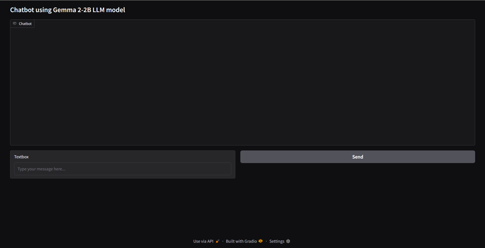
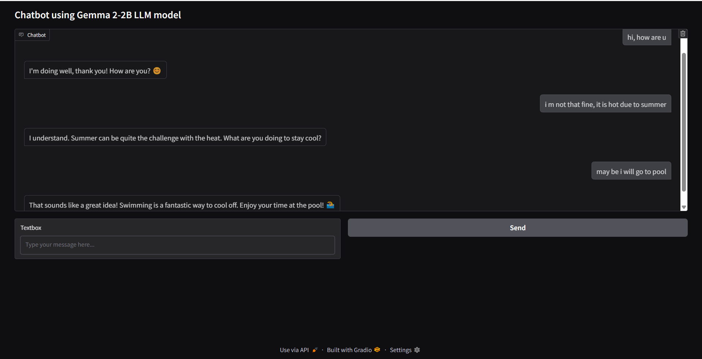

# GenAI Chatbot (google/gemma-2-2b-it)

## Project Overview

This project is a **GenAI Chatbot** built using the **google/gemma-2-2b-it** language model from Google. The chatbot leverages the power of advanced natural language processing (NLP) to generate human-like responses to user input. It features a simple and interactive Gradio-based interface that allows users to chat seamlessly with the model.

## Model Used: google/gemma-2-2b-it

The **google/gemma-2-2b-it** model is a powerful instruction-tuned causal language model designed for high-quality natural language generation. It is suitable for tasks like dialogue, Q&A, and content completion.

🔗 [View on Hugging Face](https://huggingface.co/google/gemma-2-2b-it)

## Project Screenshots

### Interface



### Chat Example



## How to Run the Application

You can run this chatbot using **Google Colab with GPU** for best performance.

### Steps:

1. **Download the notebook**:  
   Download the `Chatbot_using_Gemma_2_2B.ipynb` file from this repository.

2. **Open in Google Colab**:  
   Go to [Google Colab](https://colab.research.google.com/), upload the notebook file, and open it.

3. **Replace with your Hugging Face token**:  
   In the notebook, locate the line:
   ```python
   hf_token = "use your Huggingface token here"  # Replace with your Huggingface token
   ```
   Replace the token string with your own **Hugging Face access token**.  
   You can get your token from: https://huggingface.co/settings/tokens

4. **Install dependencies**:  
   The notebook will install required Python packages such as `transformers` and `gradio`.

5. **Run all cells**:  
   Execute each cell in sequence. The last cell will launch the chatbot interface.

6. **Start chatting**:  
   After launching, you can chat with the model through the interactive Gradio interface.

### Requirements

- **Google Colab** or a local Jupyter environment
- **Python ≥ 3.8**
- **GPU (recommended)** for faster inference
- **Hugging Face Token** for authenticated model loading

## License

This project is licensed under the MIT License. See the [LICENSE](LICENSE) file for details.

---

Let me know if you want a badge section, Hugging Face model card embed, or an auto-run Colab link too!
